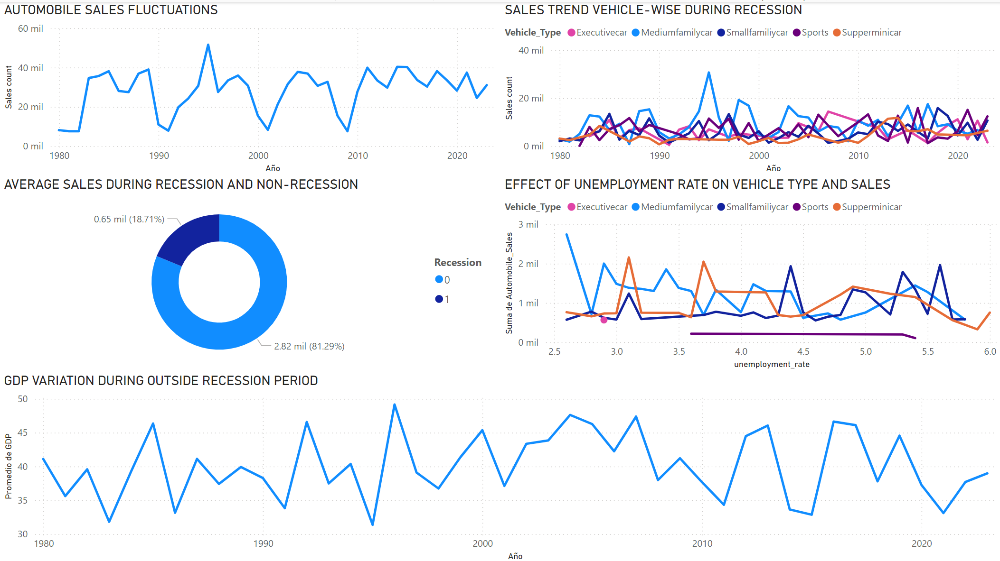

## 🛠️ Tools and Technologies Used

## 📊 Exploratory Data Analysis (EDA)

The EDA phase involves understanding the data structure, identifying patterns, and visualizing relationships among different variables. Key steps include:
- **Data Loading**: Importing data from a CSV file.
- **Data Cleaning**: Handling missing values and correcting data types.
- **Data Visualization**: Using plots to understand distributions, trends, and correlations.

## 🧠 Key Analysis Techniques

| **Technique** | **Description** |
|---------------|-----------------|
| **Time Series Analysis** | Analyzing sales trends over time to identify seasonal patterns and long-term growth. |
| **Correlation Analysis** | Understanding relationships between different variables such as economic indicators and sales. |
| **Geospatial Analysis** | Using Folium to visualize sales data on a map for geographical insights. |

## 📈 Key Findings

1. **Seasonal Trends**: The analysis revealed significant seasonal trends in automobile sales, with peaks during certain months.
2. **Economic Impact**: Correlation analysis showed a strong relationship between economic indicators and automobile sales, suggesting that macroeconomic factors play a crucial role in the industry.
3. **Geographical Insights**: Sales performance varies significantly across different regions, highlighting the importance of localized strategies.

## 📊 Power BI Report

To enhance data analysis and visualization, a comprehensive report was created using Power BI. This report includes:
- **Interactive Dashboards**: Allowing users to filter data and explore insights dynamically.
- **Visualizations**: Including bar charts, line graphs, and maps to represent sales trends and patterns.
- **KPI Tracking**: Monitoring key performance indicators over time to assess sales performance and economic impact.

